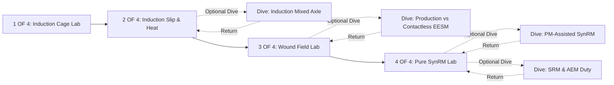

# Claude Design Prompt 6

Design **Chapter 05: Alternative motor laboratory** for the established interactive PMSM visual learning experience.

This chapter guides the learner through the four major non-PMSM motor families—induction, wound-field synchronous (EESM), synchronous reluctance (SynRM), and switched reluctance (SRM)—showing how changing the rotor mechanism alters electromagnetic torque generation, excitation control, thermal losses, inverter burden, and vehicle-level trade-offs while preserving stacked taxonomy where mechanisms combine.

The experience is designed for a curious beginner who knows nothing about motor engineering. Every state must teach **one visible mechanism**. The reader should never have to decode a complex dashboard, card clutter, nested sub-artboards, equations, or an array of overlapping labels.

---

## Non-negotiable outcome

Create a responsive, implementation-ready desktop learning interface. Its proof viewport is **1280 × 720**, but it must be implemented as a live responsive layout, not a static presentation document or fixed poster.

- **Do not generate a fixed artboard.** Do not build a 1280px-locked canvas that clips, scales down, or relies on hardcoded pixel offsets. Specify a fluid layout (`border-box`) that works cleanly across desktop/laptop widths (1024–1440px), with 1280 × 720 as the required visual proof.
- **Do not overlap labels.** No label may collide with or cross a leader line, another label, the left rail, the right panel boundary, a dock control, or the edge of the viewport. There are never more than **two short sentence-case on-stage labels** per state (maximum 3 words per label). Controls in the bottom dock are semantic UI elements, not on-stage labels, and must have dedicated reserved gutters.
- **Do not bake text into SVG.** All visual labels must exist as DOM elements outside SVG drawing groups, positioned with explicit label-anchor coordinates and clear zones.

This is an extension of the established quiet dark visual learning shell:
- **Color palette:** Dark charcoal stage (`#0F1115` / `#16191E`), fine grey separators (`#262A33`), steel grey (`#8A94A6`), copper (`#D97706` / `#B45309`), magnet purple (`#A855F7`), flux cyan (`#06B6D4`), heat red (`#EF4444`), restrained amber (`#F59E0B`), and muted green (`#10B981`) for vehicle changes.
- **Typography:** IBM Plex Sans for body/teaching copy, IBM Plex Mono for microcopy, status tags, labels, and semantic controls.
- **Layout structure:** Compact left chapter rail, large central visual teaching stage, calm right learning panel.
- **Navigation:** Click- and keyboard-based step transport. Do not turn the chapter into a long scroll page.
- **Drawers:** Why and Evidence open exclusively inside the right panel, sliding over panel content while leaving the visual stage completely visible and untouched underneath.
- **Forbidden tropes:** No cards-inside-cards, KPI tiles, gauges, equations, material recipes, atomic models, decorative legends, stock car renders, flags, maps, or company logo collages.

---

## Responsive shell specifications

### At 1280 × 720 (Primary Visual Proof Viewport):
- **Left Rail:** 36px fixed width.
- **Right Learning Panel:** 360px fixed width, with a 1px left divider border and 32px inner horizontal padding.
- **Central Stage:** Remaining 884px (`minmax(0, 1fr)`). Never set a 1280px minimum width constraint.
- **Stage Layout:** 24px left/right padding, 20px top padding. Bottom dock reserved for semantic controls (44px height), positioned safely below the main teaching region with a 24px clearance gutter.
- **Visual Region:** Large responsive SVG viewport with a 16:9 inner aspect box, keeping visual focus centred.

### At 1440 × 900 (Wider Desktop Viewport):
- **Left Rail:** 44px fixed width.
- **Right Learning Panel:** 404px fixed width.
- **Central Stage:** Remaining 992px (`minmax(0, 1fr)`).

### Narrower Desktop Viewports (1024–1279px):
- Reduce rail to 32px and panel to 300–310px before reducing stage width.
- Tighten spacing and font scale fluidly; enforce zero horizontal or vertical overflow. Phone layouts are strictly out of scope.

---

## Chapter route: exact state count & placement

The default main route contains exactly **four** states (`1 OF 4` through `4 OF 4`).
There are exactly **four** optional deep dives derived directly from canonical content, offered conditionally without breaking main-route step numbering or history.



### Main Route States:
1. `induction-cage-lab` — **Induction: make the rotor field on demand** (`1 OF 4`)
2. `induction-slip-heat-coast` — **Slip makes torque—and heat** (`2 OF 4`)
3. `wound-field-lab` — **Wound field: choose the rotor field** (`3 OF 4`)
4. `pure-synrm-lab` — **SynRM: shape steel into an easy axis** (`4 OF 4`)

### Optional Deep Dives:
- `induction-mixed-axle` — **Use each motor where it helps** (Offered after State 2)
- `brushed-contactless-status` — **Production EESM; emerging contactless excitation** (Offered after State 3)
- `pm-assisted-synrm-lab` — **Put magnets back—carefully** (Offered after State 4)
- `srm-aem-lab` — **SRM: switch poles, then show the duty** (Offered after State 4)

---

## Content and evidence-safe rules

Strictly enforce evidence bounds distilled from `evidenceAudit.ts` and `registry.json`:

1. **Induction Slip & Losses (`induction.slip_and_cage`):**
   - Show relative movement of the stator field past conductive cage bars inducing current and torque.
   - Prohibited: Never display a universal slip percentage (e.g. "5% slip") or fixed efficiency penalty. Slip and losses are machine- and load-specific.
2. **Mixed Axle Layouts (`induction.mixed_axle`):**
   - Attribute Audi Q6 e-tron and BMW Gen6 mixed-axle concepts specifically to named platforms.
   - Prohibited: Do not generalize mixed-axle configurations as standard for all dual-motor EVs.
3. **EESM Production vs. Contactless (`eesm.production_renault_nissan_bmw`, `eesm.contactless_zf`, `eesm.contactless_ibee`):**
   - Show production EESM (Renault, Nissan, BMW) separately from emerging contactless developments (ZF I2SM, Valeo/MAHLE iBEE).
   - Prohibited: Do not assert identical brush or rotor-transfer hardware across all production OEMs. Do not claim contactless EESM is in series production; ZF I2SM is advanced development and iBEE is a prototype target (220–350 kW peak).
4. **VMSM / Volektra Taxonomy (`vimag.volektra_architecture`, `vimag.volektra_corporate_relationship`):**
   - Nest VMSM/VMM under contactless wound-field synchronous excitation with DC rotor field windings.
   - Prohibited: Do not present VMSM as a separate "software-defined" physics category or claim Vimag and Volektra are proven to be a single legal corporate entity (describe overlapping public patent/technical provenance only).
5. **Pure SynRM Power Factor (`synrm-inverter-power-factor`):**
   - Show that a lower power factor increases inverter kVA and cooling burden for the same wheel power.
   - Prohibited: Do not state universal inverter size or cost multipliers.
6. **PM-Assisted SynRM Stacking (`pm-assisted-synrm-stack`):**
   - Treat PM-assisted SynRM as a stacked reluctance + permanent magnet configuration (including Tesla IPM-SynRM).
   - Prohibited: Do not classify Tesla IPM-SynRM or PM-assisted SynRM as magnet-free motors.
7. **SRM & AEM Peak vs Continuous (`aem.ssrd_peak_continuous`):**
   - AEM SSRD CV3 prototype figures (308 kW peak at 8,000 rpm, 138 kW continuous, 30,000 rpm max) must lock peak output directly to continuous duty and prototype status.
   - Prohibited: Never showcase peak power in isolation without continuous power and RPM operating conditions.

---

## Detailed state specifications

### Main State 1 — Induction: make the rotor field on demand

**State ID:** `induction-cage-lab`  
**Title:** `Induction: make the rotor field on demand`  
**Learner Question:** `How does a squirrel cage create its own rotor field?`  
**Placement:** Main route (`1 OF 4`)

#### Exact Panel Copy:
- **Glance:** `The induction rotor has no magnets and no external wires. It builds an electromagnet from the moving stator field.`
- **Why:** `If it caught up perfectly, the field would stop changing relative to the cage. No induced voltage means no rotor current and no torque.`
- **Evidence:** `[Verified Faraday-law model. Shows cage current and leading stator-field vector; does not display a generic slip percentage.]`

#### Stage Visualization:
- A simplified 2D cross-section of a squirrel-cage rotor inside a 3-phase stator.
- Aluminium/copper conductive bars connected by outer end-rings.
- Cyan rotating stator-field vector sweeps around the bore.
- As the field moves faster than the cage, induced current loops light up in copper/cyan along the rotor bars, generating a secondary rotor magnetic field and a tangential torque arrow.
- On-stage labels (Max 2): `STATOR FIELD` (pointing to cyan vector) and `INDUCED CURRENT` (pointing to cage bar loop).

#### Semantic Controls (Dock):
- `Play / pause` button: Animates or pauses the rotating stator field vector.
- `Relative speed` slider: Adjusts the speed difference between stator field and rotor cage. Lowering relative speed dims induced current loops and torque arrows toward zero.
- `Next` button: Advances to State 2 (`2 OF 4`).

#### Motion & Settling:
- 500ms smooth transition on slider movement. Field rotation settles into a stable relative offset frame when paused.

#### Reduced-Motion Frame:
- A 3-frame static triptych overlay: (1) Stator field moving past cage, (2) Induced current loop in bars, (3) Resultant torque force arrow on cage.

---

### Main State 2 — Slip makes torque—and heat

**State ID:** `induction-slip-heat-coast`  
**Title:** `Slip makes torque—and heat`  
**Learner Question:** `How do load, slip, heat and coasting connect?`  
**Placement:** Main route (`2 OF 4`)

#### Exact Panel Copy:
- **Glance:** `More load creates more slip, more induced current and more torque. It also makes rotor heat.`
- **Why:** `That rotor loss is part of induction's EV efficiency trade-off. But when power is cut, its field disappears instead of continuing to drag.`
- **Evidence:** `[Verified slip/loss relationship. Illustrates machine-specific thermal and coasting characteristics, not a universal range penalty or fixed efficiency percentage.]`

#### Stage Visualization:
- Centred squirrel-cage rotor with an active thermal loss overlay.
- Under low load, the speed gap is small, cage current is dim, and rotor heat is minimal.
- As load increases, the speed gap widens, cage current brightens, and a restrained red heat aura glows inside the rotor bars.
- Toggling `Cut power` immediately extinguishes stator field vectors, induced cage current, and magnetic drag, showing a coasting rotor without significant drag losses.
- On-stage labels (Max 2): `ROTOR HEAT` (on heavy load) and `FIELD COLLAPSES` (on cut power).

#### Semantic Controls (Dock):
- `Load` slider (Low → High): Increases speed gap, cage current intensity, torque output, and rotor heat glow.
- `Cut power` toggle (On / Off): Cuts stator current, collapsing rotor current and field lines instantly.
- `Next` button: Advances to State 3 (`3 OF 4`).

#### Motion & Settling:
- Power cut causes field lines to contract and fade in 400ms, leaving a clear coasting rotor.

#### Reduced-Motion Frame:
- Side-by-side static triptych: (1) Light load with minimal slip/heat, (2) Heavy load with highlighted cage current and heat glow, (3) Coasting cage with zero field lines.

---

### Optional Dive 1 — Use each motor where it helps

**State ID:** `induction-mixed-axle`  
**Title:** `Use each motor where it helps`  
**Learner Question:** `Why might an OEM use induction on only one axle?`  
**Placement:** Optional deep dive (Offered after State 2)

#### Exact Panel Copy:
- **Glance:** `A vehicle can combine motor types across axles instead of making one choice everywhere.`
- **Why:** `An induction axle can spin with little magnetic drag when unused, while a PM axle can carry the efficiency-focused duty.`
- **Evidence:** `[Platform-attributed evidence lane. Named examples (Audi Q6 e-tron, BMW Gen6) reflect specific platform integration, not a universal dual-motor rule.]`

#### Stage Visualization:
- Transparent top-down vehicle chassis showing two e-axles:
  - Rear axle: Permanent Magnet Synchronous Motor (PMSM) with persistent purple field.
  - Front axle: Induction Motor with dynamic cyan field.
- In `Drive` mode, both axles light up with active field vectors.
- In `Coast` mode, the front induction axle de-energises completely (without significant drag losses), while the rear PM axle handles light cruising or energy recovery.
- On-stage labels (Max 2): `PM PRIMARY` (rear axle) and `INDUCTION SECONDARY` (front axle).

#### Semantic Controls (Dock):
- `Drive mode` selector (`City Cruise` / `Highway Coast` / `AWD Peak`).
- `Back to main route` button (Returns to State 2 without altering progress).

#### Motion & Settling:
- Axle power transitions fade front-axle field lines over 450ms.

#### Reduced-Motion Frame:
- Static dual-axle chassis with rear PM drive active and front induction axle marked unpowered with unexcited coasting overlay.

---

### Main State 3 — Wound field: choose the rotor field

**State ID:** `wound-field-lab`  
**Title:** `Wound field: choose the rotor field`  
**Learner Question:** `What changes when magnets become a powered rotor winding?`  
**Placement:** Main route (`3 OF 4`)

#### Exact Panel Copy:
- **Glance:** `A wound-field motor is essentially a synchronous motor whose rotor field is made with copper instead of permanent magnets.`
- **Why:** `You can turn that field down or off. The cost is a second electrical supply and heat inside a spinning rotor.`
- **Evidence:** `[Representative engineering model. Shows hollow-shaft rotor oil cooling and variable excitation; not a single OEM design blueprint.]`

#### Stage Visualization:
- Synchronous rotor cross-section morphing from permanent magnets to copper rotor windings fed by explicit DC excitation paths.
- Adjusting `Rotor excitation` expands or shrinks the cyan rotor field vector from 0% to 100%.
- A hollow shaft path is highlighted through the rotor axis. Toggling `Rotor oil cooling` displays oil flow lines absorbing copper resistance heat from the spinning rotor core.
- On-stage labels (Max 2): `ROTOR WINDING` (pointing to copper coils) and `SHAFT COOLING` (pointing to oil channel).

#### Semantic Controls (Dock):
- `Rotor excitation` slider (0% → 100%): Controls rotor electromagnet strength independently of speed.
- `Rotor oil cooling` toggle (On / Off): Activates oil flow vectors through hollow shaft.
- `Next` button: Advances to State 4 (`4 OF 4`).

#### Motion & Settling:
- Excitation slider smoothly scales rotor field geometry over 400ms; oil flow animation settles into static directional arrows when paused.

#### Reduced-Motion Frame:
- Split cross-section showing PMSM rotor vs. Wound-Field rotor with active copper winding, DC excitation indicators, and hollow-shaft cooling arrows.

---

### Optional Dive 2 — Production EESM; emerging contactless excitation

**State ID:** `brushed-contactless-status`  
**Title:** `Production EESM; emerging contactless excitation`  
**Learner Question:** `Which EESM evidence is production, and which is contactless development?`  
**Placement:** Optional deep dive (Offered after State 3)

#### Exact Panel Copy:
- **Glance:** `Production EESM is real. Contactless excitation is a different, newer engineering route.`
- **Why:** `The retained public sources do not prove identical brush hardware in every production example. A rotating transformer, however, is a distinct contactless mechanism.`
- **Evidence:** `[Verified maturity lane. Production EESM (Renault, BMW) kept distinct from contactless development (ZF I2SM, Valeo/MAHLE iBEE 220–350 kW peak target); VMSM/VMM nested under contactless EESM.]`

#### Stage Visualization:
- Side-by-side evidence lane visual:
  - Left lane: Production EESM (representative rotor excitation / slip-ring model; hardware details OEM-specific) labeled with production status badges.
  - Right lane: Contactless EESM (inductive rotating transformer cutaway) labeled as advanced development / prototype.
- Clicking status hotspots exposes verified provenance cards without leaving the visual stage.
- On-stage labels (Max 2): `PRODUCTION EESM` (left) and `CONTACTLESS CONCEPT` (right).

#### Semantic Controls (Dock):
- `Excitation method` toggle (`Production Rotor Excitation` / `Contactless Transformer`).
- `Open status evidence` hotspot button.
- `Back to main route` button.

#### Motion & Settling:
- 500ms slide transition between excitation mechanisms.

#### Reduced-Motion Frame:
- Static two-lane comparative layout displaying production vs. contactless excitation cross-sections with clear maturity badges.

---

### Main State 4 — SynRM: shape steel into an easy axis

**State ID:** `pure-synrm-lab`  
**Title:** `SynRM: shape steel into an easy axis`  
**Learner Question:** `How can shaped steel make torque with no rotor magnet or winding?`  
**Placement:** Main route (`4 OF 4`)

#### Exact Panel Copy:
- **Glance:** `The SynRM rotor is just shaped steel. It turns toward the easier magnetic path.`
- **Why:** `That clean rotor avoids magnet supply and rotor copper loss, but the inverter can have to work harder for the same wheel power.`
- **Evidence:** `[Verified reluctance model. Demonstrates power-factor effect on inverter kVA/cooling burden; does not publish universal inverter size calculations.]`

#### Stage Visualization:
- A steel rotor sculpted with curved internal air flux-barriers.
- Stator field vector creates a magnetic flux path that seeks the path of least reluctance (the steel "easy axis" / d-axis).
- The rotor experiences a reluctance torque pulling the easy axis into alignment with the stator field.
- A secondary inverter burden indicator displays the relationship between mechanical Output kW and electrical Inverter kVA. Adjusting `Power factor` widens the kVA reactive current arc without increasing mechanical kW.
- On-stage labels (Max 2): `FLUX BARRIERS` (pointing to air cutouts) and `EASY AXIS` (pointing to steel pathway).

#### Semantic Controls (Dock):
- `Play field` button: Rotates stator field, demonstrating magnetic alignment torque.
- `Power factor` slider: Adjusts power factor, visually scaling the inverter kVA reactive current overlay.
- `Complete chapter` / `Explore dives` actions.

#### Motion & Settling:
- Stator field rotates smoothly; easy axis pulls into alignment over 600ms easing curve.

#### Reduced-Motion Frame:
- Static flux-barrier rotor with easy-axis alignment vector and an adjacent kW vs. kVA inverter burden comparison panel.

---

### Optional Dive 3 — Put magnets back—carefully

**State ID:** `pm-assisted-synrm-lab`  
**Title:** `Put magnets back—carefully`  
**Learner Question:** `Why add small magnets back into a reluctance rotor?`  
**Placement:** Optional deep dive (Offered after State 4)

#### Exact Panel Copy:
- **Glance:** `The textbook way to fix some pure-SynRM limits is to add magnets back into its barriers.`
- **Why:** `That does not make the reluctance effect disappear. It makes the architecture a stack of both mechanisms.`
- **Evidence:** `[Stacked taxonomy record. Tesla IPM-SynRM is classified as PM-assisted SynRM (stacked PM + reluctance), not a magnet-free motor.]`

#### Stage Visualization:
- Morphing visual using the same flux-barrier SynRM rotor from State 4.
- Small ferrite or NdFeB permanent magnets slide into the flux barriers.
- Torque output vector splits into two distinct color-coded components: steel reluctance torque (grey/cyan) and magnet torque (purple).
- On-stage labels (Max 2): `RELUCTANCE PATH` and `MAGNET ASSIST`.

#### Semantic Controls (Dock):
- `Magnet assist` slider (0% Pure SynRM → 100% PM-Assisted SynRM).
- `Back to main route` button.

#### Motion & Settling:
- Magnets fade/slide into barriers in 500ms as torque components adjust dynamically.

#### Reduced-Motion Frame:
- Shared flux-barrier rotor shown side-by-side: (1) Pure SynRM with empty barriers, (2) PM-Assisted SynRM with embedded magnets and dual torque arrows.

---

### Optional Dive 4 — SRM: switch poles, then show the duty

**State ID:** `srm-aem-lab`  
**Title:** `SRM: switch poles, then show the duty`  
**Learner Question:** `Why must SRM peak power be read with its continuous duty?`  
**Placement:** Optional deep dive (Offered after State 4 / Dive 3)

#### Exact Panel Copy:
- **Glance:** `SRM turns a toothed steel rotor by switching stator poles in sequence. AEM also substitutes aluminium for copper windings.`
- **Why:** `A headline peak number does not say how long the machine can hold it. The continuous-to-peak gap must be visible.`
- **Evidence:** `[Verified prototype record. AEM SSRD CV3 prototype figures (308 kW peak at 8,000 rpm, 138 kW continuous, 30,000 rpm max) must pair peak condition, continuous output, and prototype status.]`

#### Stage Visualization:
- Salient-pole switched reluctance motor (e.g. 12-stator / 8-rotor teeth).
- Sequential stator pole energisation creates discrete magnetic pulls on rotor teeth.
- Dual-indicator performance gauge locks Peak Output (308 kW @ 8,000 rpm) to Continuous Output (138 kW continuous) over a thermal duration timeline.
- Toggling `Winding material` switches stator coil cross-section between traditional copper and compressed aluminium.
- On-stage labels (Max 2): `SWITCHED POLES` (stator tooth) and `TOOTHED ROTOR` (rotor tooth).

#### Semantic Controls (Dock):
- `Sequence poles` play button: Steps through stator pole energisation sequence.
- `Hold demand` slider (Peak → Continuous duty transition).
- `Winding material` toggle (`Copper` / `Aluminium`).
- `Back to main route` button.

#### Motion & Settling:
- Pole energisation jumps discretely to next tooth pair; power bar transitions from peak to continuous over 600ms.

#### Reduced-Motion Frame:
- 4-pole static sequence diagram, aluminium vs. copper winding slice, and locked peak-to-continuous power comparison bar.

---

## Label, copy, and layout discipline

1. **Strict Label Budget:** Maximum **TWO** on-stage labels at any given instant. Each label must be short sentence-case text (maximum 3 words).
2. **Zero Overlap Guarantee:**
   - Labels must sit inside reserved clear gutters (top gutter `y: 20px–60px`, bottom gutter `y: 580px–640px`).
   - Leader lines must be 1px solid vectors (34–64px length), axis-aligned, with a single 3px anchor dot. Leaders may NEVER cross each other, cross labels, or intersect rail/panel borders.
3. **Typography & Styling:**
   - Labels use `IBM Plex Mono`, 11px uppercase/sentence-case tracking, styled in the notation color of the object identified.
   - Text must NEVER be baked into SVG image files or canvas paths; all text must render as inspectable DOM elements.
4. **Copy Boundaries:**
   - Glance copy: 1–2 short beginner-friendly sentences describing the immediate physical takeaway.
   - Why drawer: Technical explanation of the underlying electromagnetic mechanism or engineering trade-off.
   - Evidence drawer: Formal citation bounds, verification status, denominator, and explicit prohibited claim warnings.

---

## Motion, interaction, and accessibility

1. **Finite Motion:** Motion must explain a physical cause-and-effect relationship and then settle into a stable state within 400–700ms using standard cubic-bezier easing (`cubic-bezier(0.16, 1, 0.3, 1)`). No infinite spinning rotors or pulsing aura loops.
2. **Keyboard Navigation:**
   - `Right Arrow` / `Down Arrow` / `N`: Advance step.
   - `Left Arrow` / `Up Arrow` / `B`: Previous step.
   - `Spacebar`: Toggle animation play/pause.
   - `Tab` / `Shift+Tab`: Move focus sequentially across dock controls, Why button, Evidence button, and transport controls.
3. **Focus States:** Every interactive control must display an explicit 2px cyan focus ring (`#06B6D4`) with a 2px offset.
4. **Accessibility:** Minimum touch/click target size is 36px (44px recommended). High-contrast text compliance (WCAG AA minimum 4.5:1 ratio).

---

## Production handoff requirements

The output generated by Claude is art direction and production handoff documentation to be saved as:
`Ch05 Alternative motor laboratory.dc.html`

It must contain the following production artifacts:

### 1. Vector Layer IDs Table
Stable SVG/DOM element identifiers used across all Chapter 5 visualizations:

```text
#induction_stator
#squirrel_cage_rotor
#conductive_bars
#stator_field_vector
#induced_current_loop
#rotor_torque_arrow
#rotor_heat_overlay
#coast_unexcited_group
#mixed_axle_chassis
#pmsm_rear_axle
#induction_front_axle
#eesm_rotor_winding
#dc_excitation_path
#hollow_shaft_cooling
#production_rotor_excitation
#contactless_transformer
#synrm_flux_barriers
#easy_axis_d_vector
#inverter_kva_overlay
#embedded_magnets
#srm_salient_stator
#srm_toothed_rotor
#aluminium_coil_section
#peak_continuous_bar
```

### 2. Global Application State Table Schema
```typescript
interface Chapter5State {
  activeStateId: 
    | "induction-cage-lab"
    | "induction-slip-heat-coast"
    | "induction-mixed-axle"
    | "wound-field-lab"
    | "brushed-contactless-status"
    | "pure-synrm-lab"
    | "pm-assisted-synrm-lab"
    | "srm-aem-lab";
  relativeSpeed: number; // 0 to 100
  inductionLoad: number; // 0 to 100
  cutPower: boolean;
  driveMode: "city" | "highway" | "awd";
  rotorExcitation: number; // 0 to 100
  woundOilCooling: boolean;
  excitationMethod: "production" | "contactless";
  statusEvidenceOpen: boolean;
  powerFactor: number; // 0.6 to 1.0
  magnetAssist: number; // 0 to 100
  srmPhase: number; // 1 to 4
  srmDuty: "peak" | "continuous";
  windingMaterial: "copper" | "aluminium";
  whyOpen: boolean;
  evidenceOpen: boolean;
  paused: boolean;
  reducedMotion: boolean;
}
```

### 3. Label Anchor & Safe Zone Coordinates (at 1280 × 720 proof)
- Stage Width: 884px (`x: 36px` to `x: 920px`)
- Stage Height: 644px (`y: 0px` to `y: 644px`)
- Reserved Top Label Gutter: `y: 24px` to `y: 80px`
- Reserved Bottom Label Gutter: `y: 540px` to `y: 596px`
- Dock Control Clearance Zone: `y: 600px` to `y: 644px`

---

## Final acceptance checklist

Before completing handoff, verify that the design prompt and output satisfy every condition:

- [ ] **Exact Route Count:** Main route is exactly 4 states (`1 OF 4` to `4 OF 4`). The 4 optional deep dives never corrupt step numbers or history.
- [ ] **Responsive Proof:** Visual proof target is 1280 × 720 live fluid layout (`border-box`), NOT a fixed artboard or poster image.
- [ ] **Zero Overflow:** No horizontal or vertical scrollbars on the main window at 1280 × 720.
- [ ] **Label Discipline:** Maximum 2 sentence-case on-stage labels per state. Zero label collisions across all control states. No baked SVG text.
- [ ] **Evidence Safety:** Enforces all prohibited claims from `evidenceAudit.ts` (no generic slip %, no universal range loss, EESM production/contactless split, VMSM nested under EESM, AEM peak/continuous locked together).
- [ ] **Design System Integrity:** Dark charcoal background, IBM Plex typography, standard color notation (copper, magnet purple, flux cyan, heat red, restrained amber).
- [ ] **Drawer Behavior:** Why and Evidence drawers slide inside the 360px right panel only, leaving the visual stage completely untouched underneath.
- [ ] **Reduced-Motion Support:** Every state includes an informative, static reduced-motion end frame.
